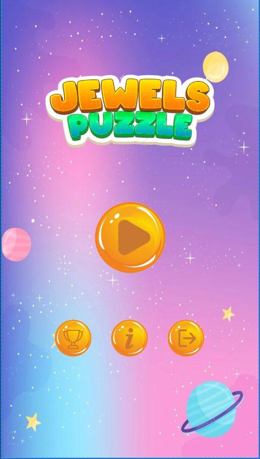
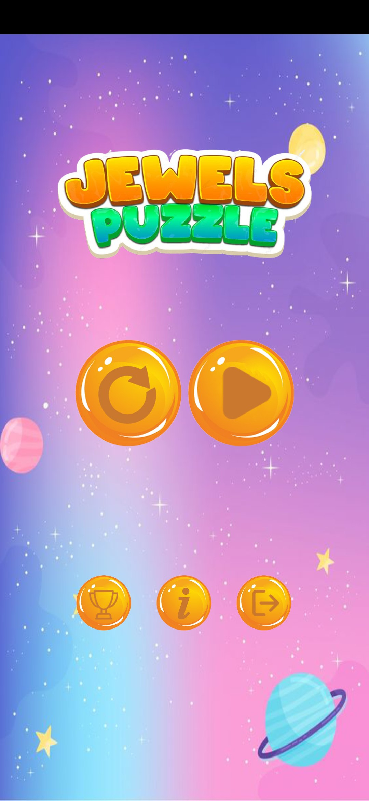
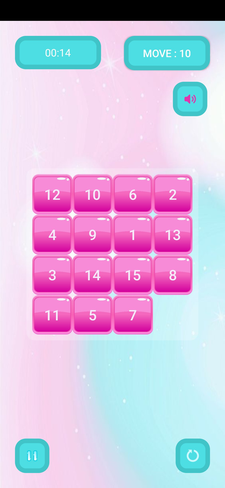
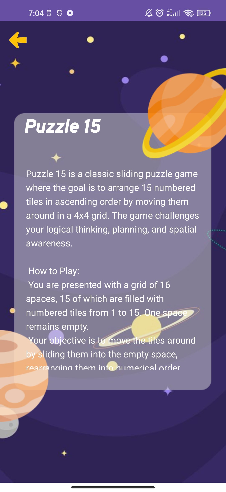

# 🧩 15 Puzzle Game

The 15 Puzzle is a classic sliding number game where the player’s goal is to arrange the numbers from 1 to 15 in order using an empty tile space.

## 📌 Key Features

🔢 Classic Gameplay – Slide numbered tiles (1–15) in a 4x4 grid to arrange them in the correct order.  
💾 SharedPreferences Integration – Save best scores and game state for continuity.  
🔄 Multi-Activity Structure – Separate screens for gameplay, settings, and leaderboard.  
💬 Interactive Dialogs – Confirmation dialogs for restart, exit, and victory.  
🎯 Score Tracking – Keep track of moves and display top performances.

## 🛠 Technology Stack

| Technology         | Description                        |
|--------------------|------------------------------------|
| Java               | Main programming language          |
| XML                | Layout design for UI               |
| SharedPreferences  | Storing scores and game progress   |
| Multi-Activity     | Separate screens for navigation    |
| AlertDialog        | User-friendly popup dialogs        |
| GridLayout         | 4x4 tile layout for puzzle tiles   |

  
  
  
  

## 🚀 How It Works

Once launched, the game shuffles the numbers and displays them in a 4x4 grid...

---

👩‍💻 **Developer:** Umida Azimova  
📧 **Contact:** azimovaumida230@example.com

